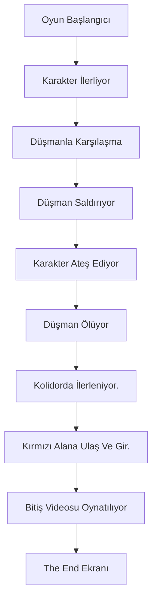

# Eve:Red Descent– Yapay Zekâ Destekli TPS (Third Person Shooter) Oyunu

**Geliştirici Ekip:** Esma Nur Mantı, Nalan Kara, Abdül Kerem Varlı  

---

## 💀 Oyun Hikayesi

Zombi virüsüyle felakete uğramış **yüksek güvenlikli bir araştırma tesisinde**, bu virüs salgınını durdurmak için askeriyeden görevlendirilen **Eve**, mutant yaratıklarla ölüm kalım mücadelesine girer.  

Virüsün yol açtığı mutasyon sonucu ortaya çıkan yaratıklarla savaşarak, tesisin merkezindeki tek çıkış noktası olan **Kritik Tahliye Bölgesi**’ne ulaşır.  

Burada, tesisin otomatik **dezenfeksiyon protokolü** devreye girer. Bölgeyi hızla dolduran kimyasal sise rağmen Eve, son düşman dalgasını alt eder ve çıkış kapısının açılmasını sağlar.  

Kapıdan dışarı çıktığında, havalanmakta olan bir **kurtarma aracı** görür. Son bir hamleyle araca doğru zıplayarak yaklaşan yaratıklardan kaçar ve tesisten uzaklaşarak kurtulur.  

🎮 **Oyun Amacı:**  
Oyuncu, düşmanları yenerek, dezenfeksiyon sürecinden sağ çıkıp ve kurtarma aracına binerek oyunu başarıyla tamamlar.

---

## 🧩 Sistem Şeması
Sistem şeması, oyuncunun girişlerini (WASD, Shift, Mouse, ESC) oyun içi kontrollerle eşleştiren akış şemasıdır.  

flowchart TD
A[Oyuncu Girdileri] --> B[Karakter Kontrol Sistemi]

subgraph Klavye Girdileri
    A1[W - İleri Git]
    A2[S - Geri Git]
    A3[A - Sola Git]
    A4[D - Sağa Git]
    A5[Shift - Hızlan (Koşu)]
    A6[ESC - Pause Menüsü]
end

subgraph Fare Girdileri
    M1[Mouse Sol Tık - Ateş Et]
end

ESC --> F[Oyun Duraklatıldı (Pause Menüsü)]

### 🎮 Açıklama:
- **W, A, S, D:** Karakterin hareketini sağlar  
- **Shift:** Hızlanma (koşu modu)  
- **Mouse Sol Tık:** Ateş etme  
- **ESC:** Pause menüsünü açar  
- **Kamera:** TPS görünümde karakteri takip eder  

---

## ⚙️ Oyun Mekanikleri (Blok Diyagramı)
Bu diyagram oyun akışını ve temel oynanış döngüsünü göstermektedir.  
Detaylı hali için: **FlowChart.png** dosyasına bakınız.

### 🎮 Açıklama:
- Oyuncu karakteri W, A, S, D ile hareket eder; Shift ile hızlanır.  
- Düşmanlar oyuncu menziline girdiğinde saldırır.  
- Oyuncu sol tık ile ateş eder, düşmanları yok eder.   
- Oyuncu kırmızı alana ulaştığında video oynar ve “The End” mesajı görünür.  

---

## 🖥️ Tasarlanan Sayfalar (Sahneler)
Bu bölüm, oyundaki sahneleri ve kullanıcı arayüzlerini açıklar.  

1. **Giriş Videosu:** Oyun başlatığıldığında oynatılır.   
2. **Ana Menü Sahnesi:** Başlat butonu bulunur.  
3. **Oyun Sahnesi:** Oyuncu karakteri, düşmanlar ve koridor ortamı yer alır.  
4. **Pause Menüsü:** ESC tuşuyla açılır; Devam Et / Ana Menü / Yeniden Başlat seçenekleri.
5. **Game Over Ekranı** | Oyuncu başarısız olduğunda açılır. “Game Over” mesajı, **Yeniden Başlat** butonu içerir.   
6. **Bitiş Videosu Sahnesi:** Eve’nin kaçış videosu otomatik olarak oynatılır.  
6. **The End Ekranı:** “The End” yazısı görüntülenir.  

---

## 📚 Literatür Taraması ve Örnek Çalışmalar

| Oyun / Çalışma | Açıklama | Bizim Oyundan Farkı |
|----------------|-----------|----------------------|
| *Resident Evil 3* | Zombi temalı TPS, yüksek grafik kalitesi | Eve:Red Descent tek bölümlük, low-poly tarzda sade bir deneyim sunar |
| *Dead Trigger* | Mobil FPS, zombi dalgalarıyla savaş | Bizim oyunumuz TPS ve hikaye temellidir |
| *Unity NavMesh Sample* | Basit yapay zekâ navigasyonu | Eve:Red Descent’te saldırı ve bitiş videosu sistemi eklenmiştir |

Bu araştırmalar, projemizin eğitim amaçlı sade ancak yapay zekâ tabanlı bir TPS oyunu olduğunu göstermektedir.  

---

## 🧠 Kullanılan Yazılım Mimarileri, Yöntemler ve Teknikler
- **Yapay Zeka Mimarisi:** FSM (Finite State Machine)  
- **Yol Bulma:** Unity NavMesh Agent  
- **Ateş Sistemi:** Raycast tabanlı hedef tespiti  
- **Video Yönetimi:** Unity VideoPlayer bileşeni  
- **Kodlama Dili:** C#  
- **Geliştirme Ortamı:** Unity 3D, Visual Studio  
- **Proje Yönetimi:** GitHub üzerinde sürüm kontrolü  

## 🚧 Karşılaşılan Zorluklar ve Çözümler

| 🧩 **Zorluk** | 🛠️ **Çözüm** |
|---------------|--------------|
| NPC’lerin oyuncuya ulaşamaması | NavMesh yeniden **bake** edilerek düzeltildi. |
| NPC'lerin devriye sırasında yürümeden kayarak ilerlemesi | Animasyonun hızı, **Agent'ın gerçek hızıyla dinamik olarak senkronize** edildi. |
| Karakterin omurgasının bükülmesi ve duruş bozukluğu | **SpineFix** adında yeni bir animasyon **Layer** ve **Prefab** oluşturularak omurga rotasyonu manuel olarak düzeltildi. |
| Ana menüden sonra oyun sahnesinin karanlık kalması | `LightSceneLoader.cs` script'i eklendi; oyun sahnesi yüklendiğinde ortam ışığı ve **Light Fixtures** grubu zorla aktif edildi. |
| Spawner, aktif NPC sayısına göre sürekli NPC üretiyordu | Üretim mantığı, `currentEnemies` yerine **totalSpawned** sayacına göre yeniden tasarlandı; belirlenen eşiğe ulaşıldığında **Coroutine** tamamen durduruldu. |

---

## 🌱 Projeden Kazanımlar
- FSM ve NavMesh sistemlerini Unity’de uygulama deneyimi  
- Raycast, trigger ve event kullanımında ilerleme  
- Oyun döngüsü ve sahne yönetimini kavrama  
- GitHub üzerinden takım çalışması ve commit yönetimi  
- C# ile yapay zekâ ve karakter kontrolü geliştirme  

---
## 🚀 Kurulum & Çalıştırma

Bu repoyu klonlayın:
1. git clone https://github.com/esmamanti/game.git
2. Unity 2022.3.62f2 sürümünü açın.
3. Projeyi `File > Open Recent Scene` menüsünden seçin.
4. `SplashScene` sahnesini çalıştırın.

## 📎 Kaynakça
1. Unity Documentation – https://docs.unity.com  
2. Game Programming Patterns – Robert Nystrom  
3. Unity Learn – FSM ve NavMesh Eğitimleri  
4. Gamasutra – *AI in Third Person Games*  
